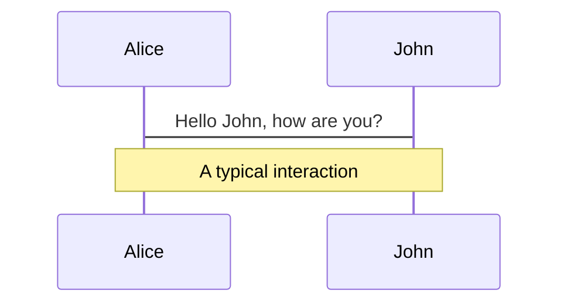
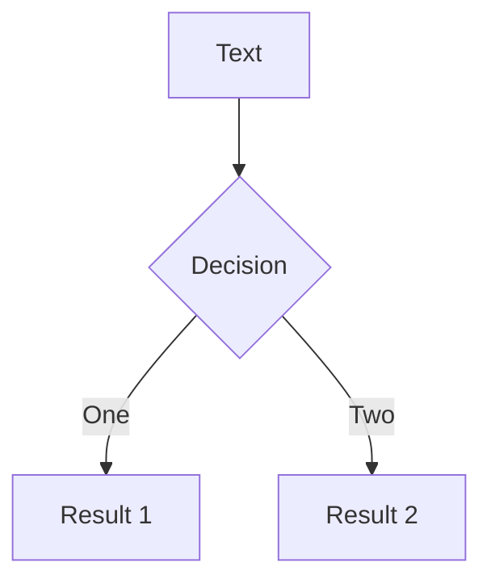
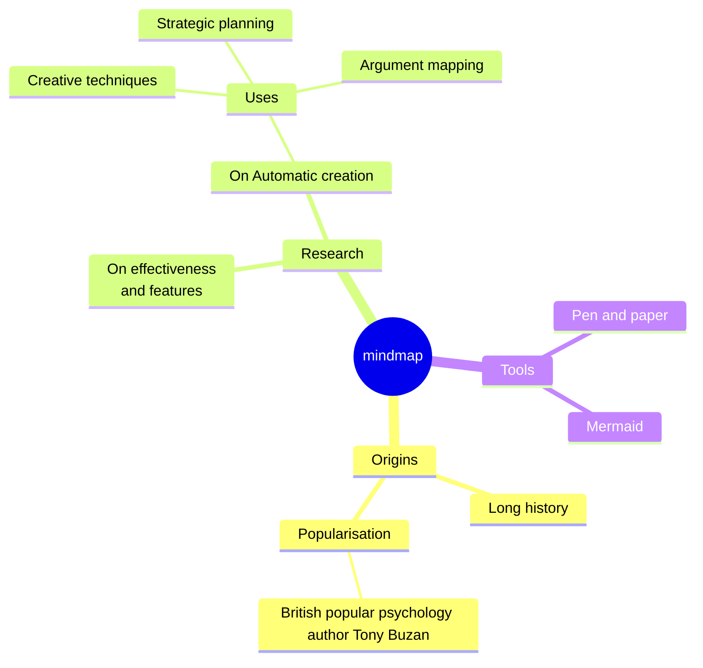
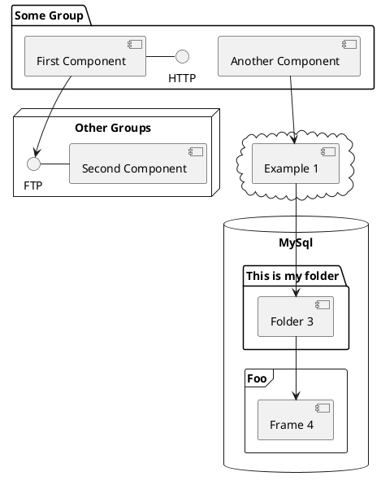

---
# You can also start simply with 'default'
theme: dracula
# random image from a curated Unsplash collection by Anthony
# like them? see https://unsplash.com/collections/94734566/slidev
background: https://cover.sli.dev
# some information about your slides (markdown enabled)
title: 이동윤, 자기소개
info: |
  ## 자기소개 시작 하나 둘 셋!

  Learn more at [Sli.dev](https://sli.dev)
# https://sli.dev/features/drawing
drawings:
  persist: false
# slide transition: https://sli.dev/guide/animations.html#slide-transitions
transition: slide-left
# enable MDC Syntax: https://sli.dev/features/mdc
mdc: true
class: text-center
fonts:
  mono: "Noto Sans Mono"
  sans: "Nanum Pen Script"
  serif: "Nanum Pen Script"
---

<style>
@font-face {
  font-family: 'Nanum Pen Script';
  src: url('/assets/fonts/NanumPenScript-Regular.ttf') format('truetype');
  font-weight: normal;
  font-style: normal;
}

body {
  font-family: 'Nanum Pen Script', 'Arial', sans-serif;
}

h1 {
  background-color: #2B90B6;
  background-image: linear-gradient(45deg, #4EC5D4 10%, #146b8c 20%);
  background-size: 100%;
  -webkit-background-clip: text;
  -moz-background-clip: text;
  -webkit-text-fill-color: transparent;
  -moz-text-fill-color: transparent;
}

</style>

  <!-- 상단 (고정 높이) -->
  <div class="absolute top-0 text-2xl inset-x-0 p-2 color-white">
    <span>안녕하세요 저는</span>
  </div>
  
  <!-- 중앙 (유연한 확장) -->
  <div class="flex-1 p-4">
    <p class="text-9xl">이동윤입니다.</p>
  </div>
  
  <!-- 하단 (고정 높이) -->

  <div @click="$slidev.nav.next" class="absolute border border-white rounded bottom-4 w-xl  left-50 p-2" hover:bg="white op-10"> 만나서 반갑습니다! 😆 
  </div>
  <div class="absolute border border-white rounded text-xl bottom-4 right-0 border-white ">
    <button @click="$slidev.nav.openInEditor()" title="Open in Editor" class="slidev-icon-btn">
      <carbon:edit />
    </button>
    <a href="https://github.com/slidevjs/slidev" target="_blank" class="slidev-icon-btn">
      <carbon:logo-github />
    </a>
  </div>

<!--
The last comment block of each slide will be treated as slide notes. It will be visible and editable in Presenter Mode along with the slide. [Read more in the docs](https://sli.dev/guide/syntax.html#notes)
-->

---
level: 2
---

# 조작법

좌하단에 호버되는 컨트롤 패널 혹은 아래의 키보드 단축키를 이용해보세요😆😆

|                                                    |                             |
| -------------------------------------------------- | --------------------------- |
| <kbd>right</kbd> / <kbd>space</kbd>                | 다음 애니메이션 혹은 슬라이드로로     |
| <kbd>left</kbd> / <kbd>shift</kbd><kbd>space</kbd> | 이전 애니메이션 혹은 슬라이드로로|
| <kbd>up</kbd>                                      | 이전 슬라이드로로             |
| <kbd>down</kbd>                                    | 다음 슬라이드로                 

---

# Who am I?

<span v-mark.underline.orange>
  간결한 코드로 안정적으로 동작하는 프로그램을 좋아하는 3년차 프론트엔드 개발자입니다.
</span>

<br>
<br>
또한 저는...
<br>
<br>

- 🛠 **UX 엔지니어** - 기술과 디자인의 교차점에서 사용자 중심 솔루션을 고민합니다.
- 🧑‍💻 **테크 얼리 어뎁터** - 새로운 기술에 대해 관심이 많으며, 프론트엔드 생태계가 어떻게 변하고 있는지 주목합니다.
- 🤹 **오픈소스 컨트리뷰터** - 오픈소스에 기여하는 것을 좋아하며, 다양한 사람과 의견을 나눕니다.
  <br>
  <br>

이기도 하고요!

<!--
You can have `style` tag in markdown to override the style for the current page.
Learn more: https://sli.dev/features/slide-scope-style
-->


<!--
Here is another comment.
-->
---
layout: two-cols
---


# 작은 TMI들


<div class='text-2xl'>
  <ol>
    <li class='m-8'>MBTI: <span v-mark.circle.orange='1'> ENTJ </span> </li>
    <li class='m-8'>취미 : <span v-mark.circle.orange='2'>운동, 게임</span></li>
    <li class='m-8'>최애 치킨 : 
   <span v-mark.circle.orange='3'>KFC 오리지널</span> 
    </li>
  </ol>
</div>

<arrow v-if="$slidev.nav.clicks === 1" x1="120" y1="450" x2="175" y2="170" color="#953" width="2" arrowSize="1" />

<arrow v-if="$slidev.nav.clicks === 2" x1="120" y1="450" x2="175" y2="250" color="#953" width="2" arrowSize="1" />

<arrow v-if="$slidev.nav.clicks === 3" x1="120" y1="450" x2="175" y2="310" color="#953" width="2" arrowSize="1" />

<div class='absolute bottom-5 p-5 border border-white rounded' v-if="$slidev.nav.clicks === 1">
근데 저 아무리 봐도 J가 아니라 P인거 같아요. 그래서 그냥 엔팁으로 살려고요.
</div>

<div class='absolute bottom-5 p-5 border border-white rounded' v-if="$slidev.nav.clicks === 2">
운동 (웨이트 트레이닝)은 매일 꾸준히 하고 있고, 게임은 AAA급 게임, 인디게임 가리지 않고 즐깁니다. 같이 하고 싶으신분 (운동이든 게임이든)은 편하게 말해주세요!
</div>

<div class='absolute bottom-5 p-5 border border-white rounded' v-if="$slidev.nav.clicks === 3">
치킨의 왕은 KFC이며, 오리지널 치킨은 그 정통한 계승자이다. 반박은 받지 않습니다.
</div>


::right::

<div class="relative">
  <!-- 첫 번째 이미지 -->
  

  <!-- 두 번째 이미지 -->
  

  <!-- 세 번째 이미지 -->
  
</div>

<style>

.image-container{
  width: 100%;
  height: 58vh;
  object-fit: contain;
  border-radius: 8px;
}

  
</style>
---

# 저는 이런 기술을 가지고 있습니다!


````md magic-move {lines: true}
```ts {1,3-8}
// 이런 언어들을 주로 다루고
export default {
  language(){
    return [
      "typescript",
      "python"
    ]
  }
}
```


```ts {1,3-9}
// 이런 라이브러리들를 좋아하며,
export default {
  libs(){
    return [
      "react",
      "storybook",
      "visx",
      "ramda.js"
    ]
  }
}
```

```ts {1,3-10}
// 이런 기술들에 관심이 많습니다!
export default {
  tools(){
    return [
      "docker",
      "WebGL",
      "AWS",
      "Neovim"
    ]
  }
}
```


````

---

# 오픈소스 활동들
##### 제 오픈소스 활동들을 소개합니다.

<br/>
<v-switch>
  <template #0>
    <div>
      <strong>sb-addon-permutation-table</strong>
      <div class="flex gap-8">
        <div class="image-layout">
          
        </div>
        <div class="flex flex-col basis-1/2">
          <div class="flex grow">
          <ul>
            <li>컴포넌트의 형상들을 하나의 스토리에서 볼 수 있게 해주는 storybook 애드온</li>
            <li>Storybook community addon 선정</li>
          </ul>
          </div>
          <div class="border-t border-white">
            <a href="https://www.npmjs.com/package/sb-addon-permutation-table" target="_blank" class="slidev-icon-btn">
              <carbon:logo-npm />
            </a>
            <a href="https://daimresearch.github.io/sb-addon-permutation-table/?path=/docs/introduction--docs" target="_blank" class="slidev-icon-btn">
              <carbon:demo />
            </a>
          </div>
        </div>
      </div>
    </div>
  </template>

  <template #1>
    <div>
      <strong>cheesy-stories</strong>
      <div class="flex gap-8">
        <div class="image-layout">
          
        </div>
        <div class="flex flex-col basis-1/2">
          <div class="flex grow">
          <ul>
            <li>Story의 width를 인터렉티브하게 조절할 수 있는 stroybook 애드온</li>
            <li>width change에 따라 변경되는 형상을 빠르게 확인 가능</li>
          </ul>
          </div>
          <div class='border-t border-white'>
            <a href="https://github.com/SpookyJelly/cheesy-stories" target="_blank" class="slidev-icon-btn">
              <carbon:logo-npm />
            </a>
            <a href="https://spookyjelly.github.io/cheesy-stories/" target="_blank" class="slidev-icon-btn">
              <carbon:demo />
            </a>
          </div>
        </div>
      </div>
    </div>
  </template>

  <template #2>
    <div>
      <strong>applejelly</strong>
      <div class="flex gap-8">
        <div class="image-layout">
          
        </div>
        <div class="flex flex-col basis-1/2">
          <div class="flex grow">
          <ul>
            <li>Datadog의 DRUIDS에 영감을 받은 컴포넌트 라이브러리</li>
            <li>🔥Now in progress🔥</li>
          </ul>
          </div>
          <div class='border-t border-white'>
            <a href="https://www.npmjs.com/package/applejelly" target="_blank" class="slidev-icon-btn">
              <carbon:logo-npm />
            </a>
            <a href="https://spookyjelly.github.io/applejelly/?path=/docs/introduction--docs" target="_blank" class="slidev-icon-btn">
              <carbon:demo />
            </a>
          </div>
        </div>
      </div>
    </div>
  </template>
</v-switch>


<style>

.image-container{
  width: 100%;
  height: 30vh;
  object-fit: contain;
  border-radius: 8px;
}
.image-layout{
  width:50%;
}

  
</style>
---
## class: px-20
---

# 포트로직스에서 이루고 싶은 것들


Slidev comes with powerful theming support. Themes can provide styles, layouts, components, or even configurations for tools. Switching between themes by just **one edit** in your frontmatter:

<div grid="~ cols-2 gap-2" m="t-2">

```yaml
---
theme: default
---
```

```yaml
---
theme: seriph
---
```


</div>

Read more about [How to use a theme](https://sli.dev/guide/theme-addon#use-theme) and
check out the [Awesome Themes Gallery](https://sli.dev/resources/theme-gallery).

---

# Clicks Animations

You can add `v-click` to elements to add a click animation.

<div v-click>

This shows up when you click the slide:

```html
<div v-click>This shows up when you click the slide.</div>
```

</div>

<br>

<v-click>

The <span v-mark.red="3"><code>v-mark</code> directive</span>
also allows you to add
<span v-mark.circle.orange="4">inline marks</span>
, powered by [Rough Notation](https://roughnotation.com/):

```html
<span v-mark.underline.orange>inline markers</span>
```

</v-click>

<div mt-20 v-click>

[Learn more](https://sli.dev/guide/animations#click-animation)

</div>

---

# Motions

Motion animations are powered by [@vueuse/motion](https://motion.vueuse.org/), triggered by `v-motion` directive.

```html
<div
  v-motion
  :initial="{ x: -80 }"
  :enter="{ x: 0 }"
  :click-3="{ x: 80 }"
  :leave="{ x: 1000 }"
>
  Slidev
</div>
```

<div class="w-60 relative">
  <div class="relative w-40 h-40">
    
    
    
  </div>

  <div
    class="text-5xl absolute top-14 left-40 text-[#2B90B6] -z-1"
    v-motion
    :initial="{ x: -80, opacity: 0}"
    :enter="{ x: 0, opacity: 1, transition: { delay: 2000, duration: 1000 } }">
    Slidev
  </div>
</div>

<!-- vue script setup scripts can be directly used in markdown, and will only affects current page -->
<script setup lang="ts">
const final = {
  x: 0,
  y: 0,
  rotate: 0,
  scale: 1,
  transition: {
    type: 'spring',
    damping: 10,
    stiffness: 20,
    mass: 2
  }
}
</script>

<div
  v-motion
  :initial="{ x:35, y: 30, opacity: 0}"
  :enter="{ y: 0, opacity: 1, transition: { delay: 3500 } }">

[Learn more](https://sli.dev/guide/animations.html#motion)

</div>

---

# LaTeX

LaTeX is supported out-of-box. Powered by [KaTeX](https://katex.org/).

<div h-3 />

Inline $\sqrt{3x-1}+(1+x)^2$

Block

$$
{1|3|all}
\begin{aligned}
\nabla \cdot \vec{E} &= \frac{\rho}{\varepsilon_0} \\
\nabla \cdot \vec{B} &= 0 \\
\nabla \times \vec{E} &= -\frac{\partial\vec{B}}{\partial t} \\
\nabla \times \vec{B} &= \mu_0\vec{J} + \mu_0\varepsilon_0\frac{\partial\vec{E}}{\partial t}
\end{aligned}
$$

[Learn more](https://sli.dev/features/latex)

---

# Diagrams

You can create diagrams / graphs from textual descriptions, directly in your Markdown.

<div class="grid grid-cols-4 gap-5 pt-4 -mb-6">









</div>

Learn more: [Mermaid Diagrams](https://sli.dev/features/mermaid) and [PlantUML Diagrams](https://sli.dev/features/plantuml)

---
foo: bar
dragPos:
square: 691,32,167,\_,-16
---
dragPos:
square: -17,0,0,0
---
dragPos:
square: -17,0,0,0
---
dragPos:
square: 0,-676,0,0
---
dragPos:
square: -17,0,0,0
---
dragPos:
square: -17,0,0,0
---
dragPos:
square: -17,0,0,0
---
dragPos:
square: 0,-206,0,0
---
dragPos:
square: 0,-206,0,0
---
dragPos:
  square: 0,-277,0,0
---
dragPos:
  square: 0,-260,0,0
---

# Draggable Elements

Double-click on the draggable elements to edit their positions.

<br>

###### Directive Usage

```md

```

<br>

###### Component Usage

```md
<v-drag text-3xl>
  <div class="i-carbon:arrow-up" />
  Use the `v-drag` component to have a draggable container!
</v-drag>
```

<v-drag pos="588,58,261,_,-15">
  <div text-center text-3xl border border-main rounded>
    Double-click me!
  </div>
</v-drag>


###### Draggable Arrow

```md
<v-drag-arrow two-way />
```

<v-drag-arrow pos="120,221,555,4" two-way op70 />

---
src: ./pages/imported-slides.md
hide: false
---


---

# Monaco Editor

Slidev provides built-in Monaco Editor support.

Add `{monaco}` to the code block to turn it into an editor:

```ts {monaco}
import { ref } from "vue";
import { emptyArray } from "./external";

const arr = ref(emptyArray(10));
```

Use `{monaco-run}` to create an editor that can execute the code directly in the slide:

```ts {monaco-run}
import { version } from "vue";
import { emptyArray, sayHello } from "./external";

sayHello();
console.log(`vue ${version}`);
console.log(
  emptyArray<number>(10).reduce(
    (fib) => [...fib, fib.at(-1)! + fib.at(-2)!],
    [1, 1]
  )
);
```

---
layout: center
class: text-center
---

# Learn More

[Documentation](https://sli.dev) · [GitHub](https://github.com/slidevjs/slidev) · [Showcases](https://sli.dev/resources/showcases)

<PoweredBySlidev mt-10 />
